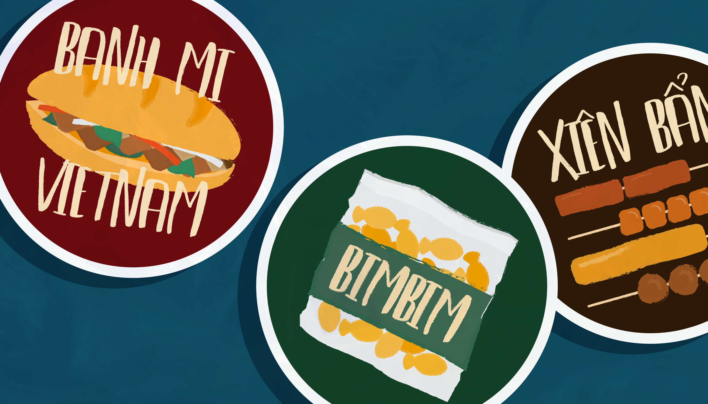
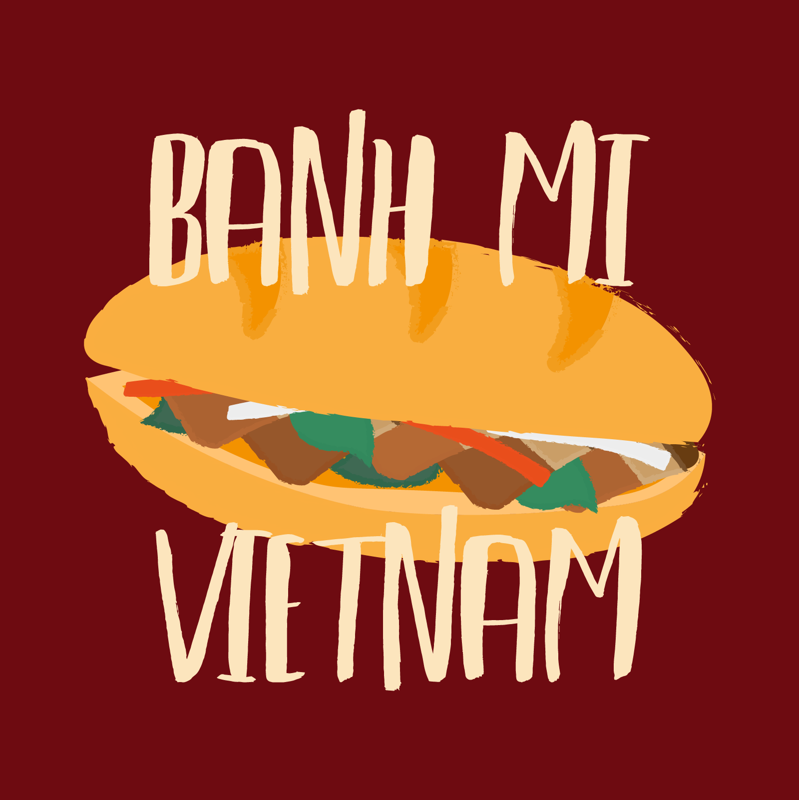
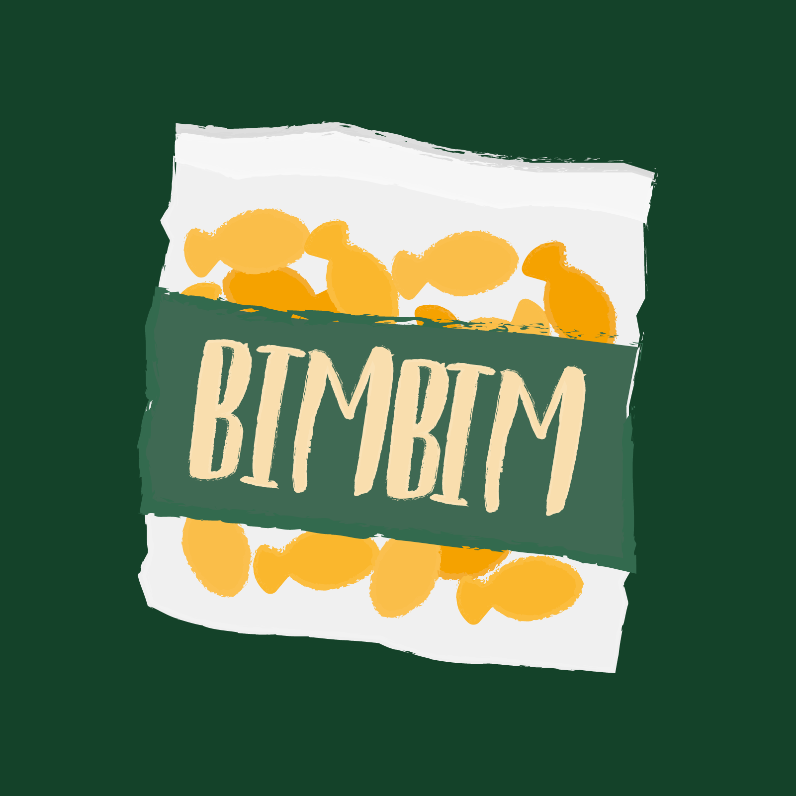
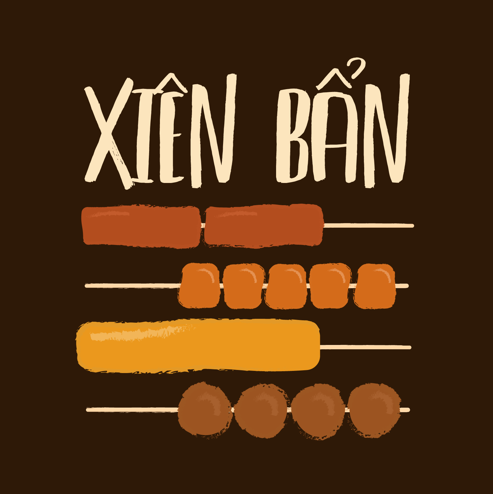
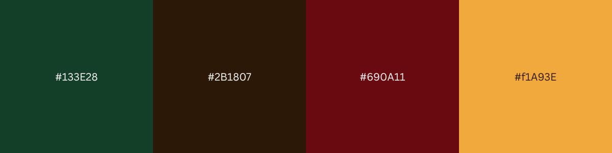

# ĐÓI Sticker - 2024

Category: Graphic Design

Đói stickers were inspired by Vietnamese street food. I named the collection "Đói", which means "hungry", because I was indeed hungry in class and I could not think of anything else.

