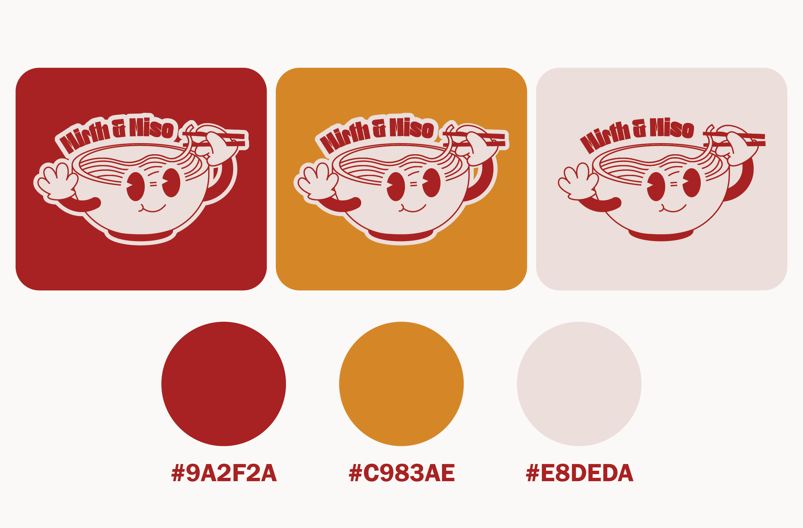
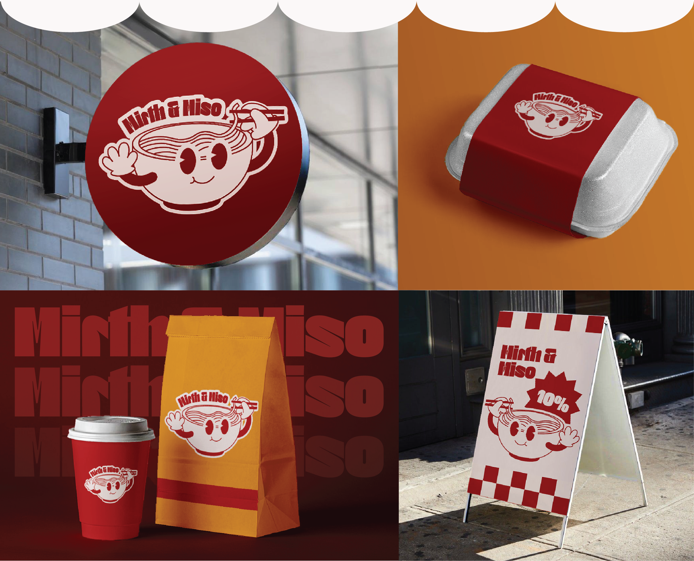
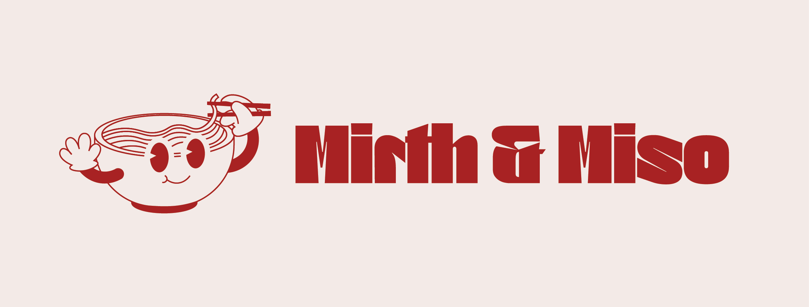

# Mirth and Miso - 2025

Category: Graphic Design

Mirth&Miso is a playful, Asian-inspired casual restaurant serving ramen, boba in cozy, colorful spaces. Designed for students and young professionals, we bring bold flavors, a welcoming vibe, and a touch of fun to every dining experience. 

